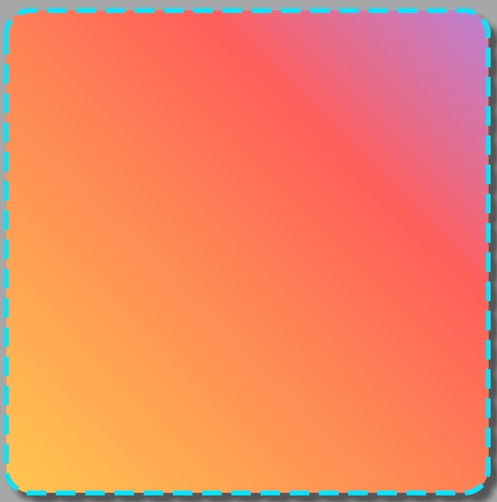

## Drawable Resource


http://blog.csdn.net/guolin_blog/article/details/51763825
https://gist.github.com/hamakn/8939eb68a920a6d7a498#gistcomment-2029814
https://developer.android.com/training/system-ui/status.html
https://github.com/laobie/StatusBarUtil
http://www.jianshu.com/p/aca4fd6743b1
https://medium.com/google-developers/why-would-i-want-to-fitssystemwindows-4e26d9ce1eec
http://www.jianshu.com/p/0acc12c29c1b
https://github.com/hehonghui/android-tech-frontier/blob/master/issue-35/%E4%B8%BA%E4%BB%80%E4%B9%88%E6%88%91%E4%BB%AC%E8%A6%81%E7%94%A8fitsSystemWindows.md
http://www.jianshu.com/p/f3683e27fd94
##Layer List

[LayerDrawable](http://developer.android.com/reference/android/graphics/drawable/LayerDrawable.html)是一个能够管理一组drawable的drawable对象。一组中的每一个对象将会按照顺序进行绘制。

语法

```xml

<?xml version="1.0" encoding="utf-8"?>
<layer-list
    xmlns:android="http://schemas.android.com/apk/res/android" >
    <item
        android:drawable="@[package:]drawable/drawable_resource"
        android:id="@[+][package:]id/resource_name"
        android:top="dimension"
        android:right="dimension"
        android:bottom="dimension"
        android:left="dimension" />
</layer-list>

```

## Shape Drawable

Shape Drawable用于绘制常见的形状，其基本语法如下。

```xml

<?xml version="1.0" encoding="utf-8"?>
<shape
    xmlns:android="http://schemas.android.com/apk/res/android"
    android:shape=["rectangle" | "oval" | "line" | "ring"] >
    <corners
        android:radius="integer"
        android:topLeftRadius="integer"
        android:topRightRadius="integer"
        android:bottomLeftRadius="integer"
        android:bottomRightRadius="integer" />
    <gradient
        android:angle="integer"
        android:centerX="integer"
        android:centerY="integer"
        android:centerColor="integer"
        android:endColor="color"
        android:gradientRadius="integer"
        android:startColor="color"
        android:type=["linear" | "radial" | "sweep"]
        android:useLevel=["true" | "false"] />
    <padding
        android:left="integer"
        android:top="integer"
        android:right="integer"
        android:bottom="integer" />
    <size
        android:width="integer"
        android:height="integer" />
    <solid
        android:color="color" />
    <stroke
        android:width="integer"
        android:color="color"
        android:dashWidth="integer"
        android:dashGap="integer" />
</shape>

```

### shape


`android:shape`定义形状，可用的值包括`rectangle(矩形)`、`oval(椭圆形)`、`line(线)`、`ring(圆形)`


### corners

corners标签用于指定角。

* `android:radius`尺寸值。所有角的半径。
* `android:topLeftRadius`尺寸值。左上角的半径。
* `android:topRightRadius`尺寸值。右上角的半径。
* `android:bottomLeftRadius`尺寸值。左下角的半径。
* `android:bottomRightRadius`尺寸值。右下角的半径。

### gradient

定义颜色渐变。

* `android:angle`Integer值。渐变的角度。0是从左到右，90是从底部到顶部。值必须是`45`的倍数。默认是`0`。
* `android:centerX`：相对于x为中心
* `android:centerY`：相对于y为中心
* `android:centerColor`：中间颜色
* `android:endColor`：结束颜色
* `android:gradientRadius`：渐变半径，只有当type为radial时才可用。
* `android:startColor`：开始颜色
* `android:type`：可用值得包括linear，radial和sweep。

### padding
设置padding
### size
设定形状大小

### solid
用于填充形状。
### stroke

Shape的边线。

* `android:width`：线的宽度
* `android:color`：虚线的颜色
* `android:dashGap`：虚线之间的距离
* `android:dashWidth`：虚线的宽度

示例

```xml
<?xml version="1.0" encoding="utf-8"?>
<shape xmlns:android="http://schemas.android.com/apk/res/android"
    android:shape="rectangle">
    <stroke
        android:width="1dp"
        android:color="@android:color/holo_blue_bright"
        android:dashGap="2dp"
        android:dashWidth="4dp" />
    <size
        android:width="100dp"
        android:height="100dp" />

    <solid android:color="@android:color/holo_orange_light" />

    <corners android:radius="5dp" />
    <!--覆盖了solid填充的颜色-->
    <gradient
        android:angle="45"
        android:centerColor="@android:color/holo_red_light"
        android:centerX="0.7"
        android:endColor="@android:color/holo_purple"
        android:startColor="@android:color/holo_orange_light"
        android:type="linear" />

</shape>

```




## 阅读更多
