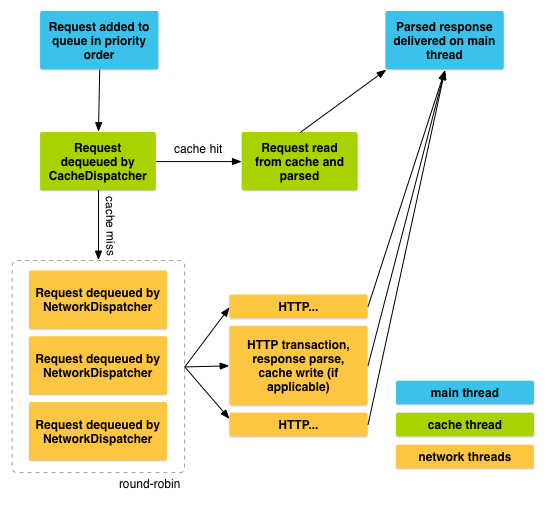

# 发送一个简单的请求

> 原文：https://developer.android.com/training/volley/simple

在高层次上，您可以通过创建一个`RequestQueue`并传递 `Request`对象来使用Volley 。`RequestQueue`管理运行网络操作，读取和写入到缓存中，解析响应返回值的工作线程。请求执行原始响应的解析，Volley负责将解析后的响应分派回主线程以进行传递。

本课描述了如何使用`Volley.newRequestQueue` 便捷方法发送请求，该方法为您设置了一个`RequestQueue`。请参阅下一课“ [设置RequestQueue”](https://developer.android.com/training/volley/requestqueue.html)，以获取有关如何设置`RequestQueue`自己的信息。

本课还介绍了如何向`RequestQueue`中添加请求和取消请求。

## 添加INTERNET权限

要使用Volley，必须将`android.permission.INTERNET`权限添加 到应用程序的清单中。否则，您的应用将无法连接到网络。

## 使用newRequestQueue

Volley提供了一种方便的方法`Volley.newRequestQueue`，该方法使用默认值为您设置`RequestQueue` 并启动队列。例如：

```java
final TextView textView = (TextView) findViewById(R.id.text);
// ...

// Instantiate the RequestQueue.
RequestQueue queue = Volley.newRequestQueue(this);
String url ="http://www.google.com";

// Request a string response from the provided URL.
StringRequest stringRequest = new StringRequest(Request.Method.GET, url,
            new Response.Listener<String>() {
    @Override
    public void onResponse(String response) {
        // Display the first 500 characters of the response string.
        textView.setText("Response is: "+ response.substring(0,500));
    }
}, new Response.ErrorListener() {
    @Override
    public void onErrorResponse(VolleyError error) {
        textView.setText("That didn't work!");
    }
});

// Add the request to the RequestQueue.
queue.add(stringRequest);
```

Volley总是在主线程上传递已解析的响应。在主线程上运行很方便用接收到的数据填充UI控件，因为您可以直接从响应处理程序自由地修改UI控件，但这对于库提供的许多重要语义特别重要，尤其是与取消请求有关。

请参阅[设置请求队列](https://developer.android.com/training/volley/requestqueue.html)，以获取有关如何设置`RequestQueue`自己（而不是使用 `Volley.newRequestQueue`便捷方法）的描述。

## 发送请求

发送一个请求，你只需构建一个并把它添加到`RequestQueue`用 `add()`，如上图所示。一旦添加了请求，它就会在管道中移动，得到服务并解析并传递其原始响应。

当您调用时`add()`，Volley运行一个高速缓存处理线程和一个网络调度线程池。将请求添加到队列时，该请求将由缓存线程拾取并进行分类：如果可以从缓存中处理该请求，则缓存的响应将在缓存线程上解析，解析的响应会在主线程上传递。如果无法通过缓存为请求提供服务，则会将其放置在网络队列中。第一个可用的网络线程从队列中获取请求，执行HTTP事务，在工作线程上解析响应，将响应写入缓存，然后将解析后的响应发布回主线程以进行传递。

请注意，诸如阻塞I / O和解析/解码之类的昂贵操作是在辅助线程上完成的。您可以从任何线程添加请求，但是响应始终在主线程上传递。

图1说明了请求的生命周期：



## 取消要求

要取消请求，请调用`cancel()`您的`Request`对象。一旦取消，Volley保证将永远不会调用您的响应处理程序。实际上，这意味着您可以使用活动的`onStop()`方法取消所有待处理的请求， 而不必通过检查`getActivity() == null`，是否`onSaveInstanceState()`已被调用或其他防御性样例来填充响应处理程序。

要利用此行为，通常必须跟踪所有进行中的请求，以便能够在适当的时间取消它们。有一种更简单的方法：您可以将标记对象与每个请求关联。然后，您可以使用此标记提供取消请求的范围。例如，您可以标记所有代表的请求`Activity`，然后`requestQueue.cancelAll(this)`从 发出呼叫`onStop()`。同样，您可以在一个`ViewPager`标签中用其各自的标签标记所有缩略图请求， 并在滑动时取消以确保新标签不会被另一个请求所阻止。

这是一个使用字符串值作为标记的示例：

1. 定义标签并将其添加到您的请求中。

```java
public static final String TAG = "MyTag";
StringRequest stringRequest; // Assume this exists.
RequestQueue requestQueue;  // Assume this exists.

// Set the tag on the request.
stringRequest.setTag(TAG);

// Add the request to the RequestQueue.
requestQueue.add(stringRequest);
```

2. 在您`Activity`的`onStop()`方法中，取消所有带有此标记的请求

```java
@Override
protected void onStop () {
    super.onStop();
    if (requestQueue != null) {
        requestQueue.cancelAll(TAG);
    }
}
```

取消请求时请多加注意。如果您依靠响应处理程序来推进状态或启动另一个进程，则需要考虑这一点。同样，将不会调用响应处理程序。