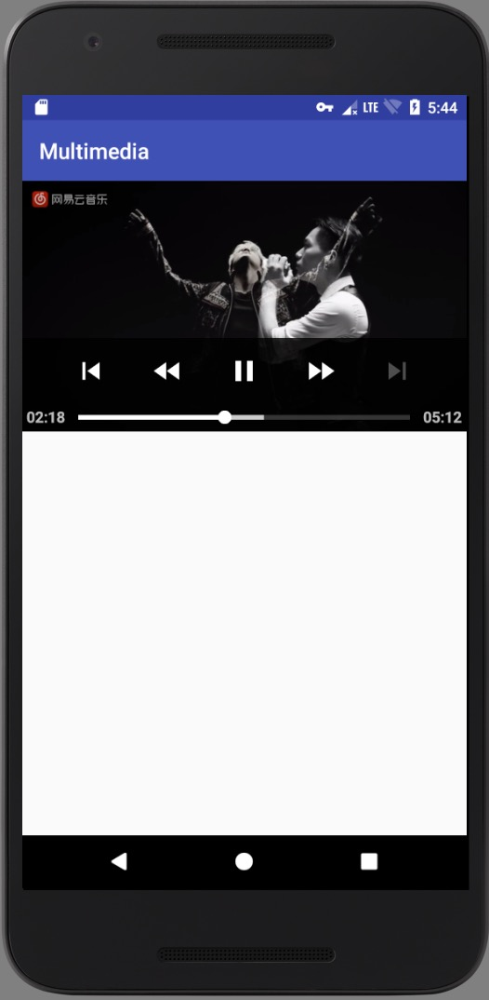

# ExoPlayer使用

## 1.介绍

Android提供了MediaPlayer可以使用少量的代码快速实现媒体播放功能。同时还提供了偏向底层的媒体api如MediaCodec、AudioTrack和MediaDrm，可以利用这些去构建自定义媒体播放方案。

ExoPlayer是构建在Android底层媒体api之上的应用级别的开源项目。

## 2.特点

ExoPlayer对比MediaPlayer具有以下优点：

1. 支持基于HTTP的动态自适应流 \(DASH\) 和SmoothStreaming，任何目前MediaPlayer 支持的视频格式，同时它还支持 HTTP 直播\(HLS\)，MP4，MP3，WebM，M4A，MPEG-TS 和 AAC。 

2. 支持高级的 HLS 特性，例如正确处理 EXT-X-DISCONTINUITY 标签。 

3. 能够无缝地合并，连接和循环媒体。 

4. 具有自定义和扩展播放器以适应您的用例的能力。ExoPlayer专门设计了这一点，并允许许多组件被替换为自定义实现。 

5. 便于随着 App 的升级而升级。因为 ExoPlayer 是一个包含在你的应用中的库，对于你使用哪个版本有完全的控制权，并且你可以简单的跟随应用的升级而升级；

6. 更少的适配性问题。 

7. 支持Android 4.4（API等级19）以上的Widevine通用加密。

缺点： ExoPlayer的标准视频和音频组件依赖Android的MediaCodec,该接口发布于Android4.1，因此不能在Android4.1之前的版本使用ExoPlayer。

## 3.库介绍

`ExoPlayer`库的核心是ExoPlayer接口。ExoPlayer提供传统的媒体播放功能例如媒体缓冲、播放，暂停和快进等。ExoPlayer实现不是直接实现媒体的加载和呈现，而是委托给其他组件来完成。常用的组件包括如下。

* 一个MediaSource表示一个媒体资源，当调用`ExoPlayer`的prepare方法时，传入MediaSource。
* Renderer渲染媒体的独立组件，当player创建时Renderer被注入。
* TrackSelector选择由MediaSource提供的轨道，以供每个可用渲染器使用。当播放器创建时，TrackSelector将被注入。
* LoadControl用于控制媒体的加载。在创建播放器时注入LoadControl。

这些组件提供了默认的实现以满足常见的用例。用户也可以自定义组件。

## 4.基本使用

### 1.添加ExoPlayer的依赖

1. 首先确保工程根目录下build.gradle文件包含jcenter repository。

   ```groovy
   repositories {
    jcenter()
   }
   ```

2. 添加一个gradle compile dependency到你的app下的build.gradle文件中。

   ```groovy
   compile 'com.google.android.exoplayer:exoplayer:r2.X.X'
   ```

3. 你也可以只添加你需要的库。例如要开发一个只支持DASH内容播放的应用程序，则只需添加依赖Core，DASH和UI库模块。

   ```groovy
   compile 'com.google.android.exoplayer:exoplayer-core:r2.X.X'
   compile 'com.google.android.exoplayer:exoplayer-dash:r2.X.X'
   compile 'com.google.android.exoplayer:exoplayer-ui:r2.X.X'
   ```

可用模块包括如下：

* exoplayer-core：包含核心功能，所以必须被添加
* exoplayer-dash：支持DASH内容
* exoplayer-hls：支持HLS内容
* exoplayer-smoothstreaming：支持SmoothStreaming内容
* exoplayer-ui：UI组件和资源。

可以查看[Bintray](https://bintray.com/google/exoplayer)上的工程,了解更多的信息。

### 2.创建ExoPlayer实例

ExoPlayerFactory提供了多个创建ExoPlayer实例的方法。大多数情况下ExoPlayerFactory.newSimpleInstance方法，该方法返回一个SimpleExoPlayer对象。

```java
//1.创建一个默认的 TrackSelector
DefaultBandwidthMeter bandwidthMeter = new DefaultBandwidthMeter();
TrackSelection.Factory videoTrackSelectionFactory = new AdaptiveTrackSelection.Factory(bandwidthMeter);
TrackSelector trackSelector = new DefaultTrackSelector(videoTrackSelectionFactory);
// 2.创建Player
final SimpleExoPlayer player = ExoPlayerFactory.newSimpleInstance(this, trackSelector);
```

### 3.将player关联到view上

ExoPlayer提供了一个SimpleExoPlayerView包含了一个`PlaybackControlView`和用于渲染视频的`Surface`。

在xml中添加`SimpleExoPlayerView`

```markup
<LinearLayout
    xmlns:android="http://schemas.android.com/apk/res/android"
    xmlns:tools="http://schemas.android.com/tools"
    android:layout_width="match_parent"
    android:layout_height="match_parent"
    android:orientation="vertical"
    tools:context="cn.malinkang.multimedia.ExoPlayerSampleActivity">
    <com.google.android.exoplayer2.ui.SimpleExoPlayerView
        android:id="@+id/simpleExoPlayerView"
        android:layout_width="match_parent"
        android:layout_height="wrap_content"/>

</LinearLayout>
```

通过setPlayer方法将player和view绑定：

```java
simpleExoPlayerView.setPlayer(player);
```

### 4.准备Player

在ExoPlayer中，每一块媒体均由MediaSource表示。要播放一块媒体，您必须先创建一个相应的MediaSource，然后将此对象传递给ExoPlayer.prepare。 ExoPlayer库为DASH（DashMediaSource），SmoothStreaming（SsMediaSource），HLS（HlsMediaSource）和常规媒体文件（ExtractorMediaSource）都提供了MediaSource的实现。以下代码显示如何使用适合播放MP4文件的MediaSource准备播放器。

```java
DataSource.Factory dataSourceFactory = new DefaultDataSourceFactory(this,
            Util.getUserAgent(this, "Multimedia"));
ExtractorsFactory extractorsFactory = new DefaultExtractorsFactory();
MediaSource videoSource = new ExtractorMediaSource(
        Uri.parse("file:///android_asset/aimei.mp4"),
        dataSourceFactory, extractorsFactory, mainHandler,
        new ExtractorMediaSource.EventListener() {
            @Override
            public void onLoadError(IOException error) {
                Log.e(TAG, "onLoadError: " + error.getMessage());
            }
        });
player.prepare(videoSource);
```

按照上面的步骤，我们可以实现一个视频播放的功能。



## 扩展阅读


ijkplayer对比ExoPlayer优势：
* ijkplayer基于ffmpeg，更容易定制
* 扩平台更容易维护
* ijkplayer支持2.3+，ExoPlayer支持4.1+


